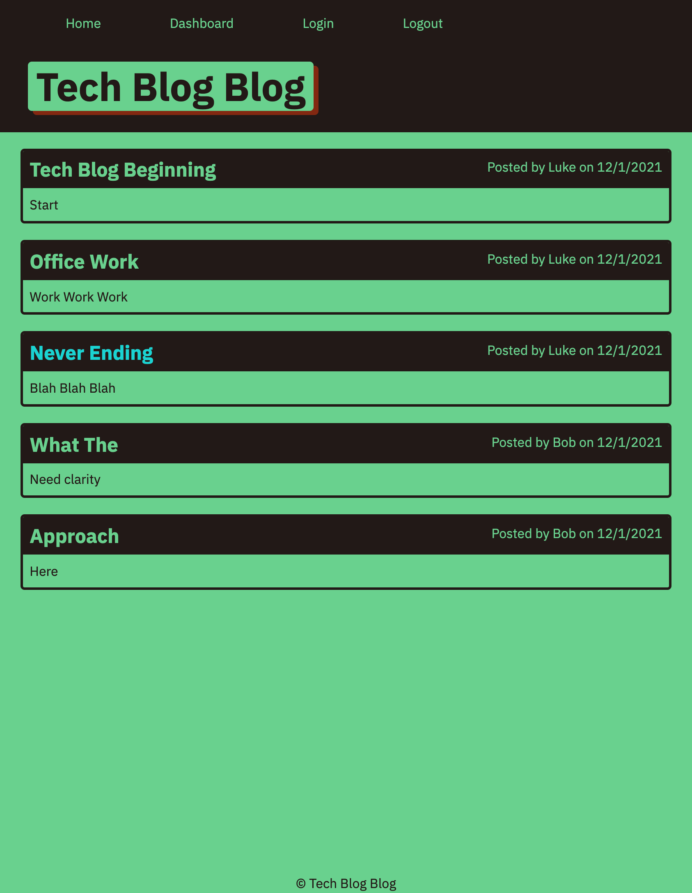

# MVC Tech Blog

  
  
  ## Description
  Application is a CMS style blog site that allows individuals to publish articals, blog posts, thoughts and opinions.
  
  ## Table of Contents
  - [Description](#description)
  - [Installation](#installation)
  - [Screenshot](#screenshot)
  - [Link](#link)
  - [Usage](#usage)
  - [License](#license)
  - [Contributing](#contributing)
  - [Tests](#tests)
  - [Questions](#questions)
  
  ## Installation
  Application is deployed using heroku. Posts can be viewed on the dashboard. If you would like to add a post or comment, create your account. 

  ## Screenshot
  
  
  ## Link
  Application is deployed using heroku and can be access at https://tech-blog-blog.herokuapp.com/

  ## Usage
  Project is used for tech related content and discussion.
  
  ## License
  
  
   
  This application is covered under the MIT license.

  ## Contributing
  via github

  ## Tests
  no tests are included.

  ## Questions
  Please report issues via github.
  
  Find me on GitHub: [lukemcmi](https://github.com/lukemcmi)
  
  Email me if you have any questions: N/A

